# Hermes Web Frontend

Blazor **Web App** (.NET 10) with **Interactive WebAssembly**: the server host serves HTML and static assets; interactive UI runs in the browser as **WebAssembly** and calls **Hermes.Api** over HTTP (JWT + refresh token).

Full API documentation: [`../Hermes.Api/README.md`](../Hermes.Api/README.md).

Screenshots for this Blazor app live in **[`Documentation/`](../Documentation/)** (paths below use `../Documentation/…` relative to this folder). Naming conventions, compression, and asset workflow are documented in **[root README — Documentation assets](../README.md#documentation-assets-screenshots--diagrams)**. The **[UI Screenshots](#ui-screenshots)** section repeats the same images with walkthrough captions.

### Role and scope

This frontend is for **defining and maintaining settings the Hermes worker needs** (scheduler / digest delivery) and for making **authentication observable**, for example **JWT**, refresh tokens, and session via the login and registration flows and the API client.

It also covers the **end-user experience**: **setting up and editing email digest preferences** (topics, cadence, content), **defining the outgoing mail** (what gets sent and how it reads), and choosing the **name users want to be addressed by**, wired to the API and worker.

---

## Projects in this folder

| Project | Role |
|--------|------|
| **Hermes.WebFrontend** | ASP.NET Core host: `Program.cs`, root `App.razor`, `Routes`, **MainLayout**, error/not-found pages, static assets under `wwwroot/` (global CSS, Swiss tokens). |
| **Hermes.WebFrontend.Client** | Blazor **WebAssembly** assembly: pages, layouts, components, `Program.cs` (DI, `HttpClient`, local storage), client `wwwroot/appsettings*.json`. |

The router loads routes from **both** assemblies; the default layout is **MainLayout** (full-viewport poster background + content slot for `@Body`).

---

## Prerequisites

- **.NET SDK** (solution targets .NET 10)
- **Hermes.Api** running (often `http://localhost:5165/` in docs) and a reachable **MySQL** database
- **CORS:** the API only allows configured origins (`Cors:AllowedOrigins` in `Hermes.Api`). For local Blazor debugging, add the actual frontend origin (e.g. `http://localhost:5269` from `Properties/launchSettings.json`).

---

## Configuration (client)

Files: `Hermes.WebFrontend.Client/wwwroot/appsettings.json` and optionally `appsettings.Development.json`.

| Key | Meaning |
|-----|---------|
| **`ApiBaseUrl`** | API base URL **with** trailing `/`, e.g. `http://localhost:5165/`. If empty, the client falls back to its own origin (`BaseAddress`). |
| **`Session:IdleTimeoutDays`** | Idle window for the client session (used with `AuthSessionService` / token handling). |

The scoped WASM `HttpClient` sets `BaseAddress` from this config. A separate **named** `HttpClient` without the auth handler is used for anonymous calls (e.g. refresh).

---

## Run locally

From `Hermes.WebFrontend/Hermes.WebFrontend`:

```bash
dotnet run
```

`Properties/launchSettings.json` profiles typically use **HTTPS** (`https://localhost:7016`) and **HTTP** (`http://localhost:5269`).

**Order:** start the API (and DB) first, then the frontend. If the browser console shows CORS errors, add the real frontend origin under `Hermes.Api` → `Cors:AllowedOrigins`.

---

## Routing and layouts

| Route | Page | Layout / notes |
|-------|------|----------------|
| `/` | `RootRedirect` | MainLayout; redirects to login or home depending on session. |
| `/login` | Login | **AuthLayout** (split form + `AuthSwissPoster`). |
| `/register` | Register | AuthLayout; password strength checklist (same rules as profile **new password**); `POST api/v1/users` then login, tokens in local storage, navigate to `/home`. |
| `/home` | Home | **AppHomeLayout** (top nav + main area); Swiss poster content. |
| `/news-settings`, `/news-settings/new` | News configuration | AppHomeLayout; list/edit via `NewsSettingsPanel` / `NewsSubscriptionCard`. |
| `/user-settings` | Profile | AppHomeLayout; name, e-mail, optional password change (`PUT api/v1/users` with `newPassword` / `currentPassword`). **E-mail verification**: badges (`UserScope.isEmailVerified`), warning when unverified, modal to enter **six-digit code** (`POST api/v1/users/verify/code`) and resend with cooldown (`GET api/v1/users/verify/{email}`). **Password**: same rule checklist as registration for **new** password; submit button can look inactive while invalid but stay clickable for guidance; **wrong current password** shows an inline error under **Old password** (API returns **400** with `type` `https://hermes.dev/problems/wrong-current-password`). **E-mail change** clears verified state server-side until the user verifies again. |

Error pages: server components under `Hermes.WebFrontend/Components/Pages/` (e.g. `/Error`, status-code reexecute to not-found).

---

## Authentication (overview)

- **`AuthTokenStore`**: access and refresh tokens in **Blazored.LocalStorage**; load/persist helpers.
- **`AuthMessageHandler`**: adds `Authorization: Bearer` on outgoing API requests for the scoped `HttpClient`.
- **`AuthSessionService`**: session checks, refresh, idle timeout; uses the **named** `HttpClient` without Bearer for `POST api/v1/auth/refresh`.
- **`GlobalAuthGuard`**: wired in `App.razor`; on navigation, public paths (`/`, `/login`, `/register`, `/Error`) vs. protected routes; redirect to `/login` when there is no token.
- **`AuthLogoutService`**: sign-out including API logout and clearing tokens locally.

Public API endpoints include registration, login, and refresh. Protected calls use the JWT from the store.

---

## UI / design

- **Design tokens:** `wwwroot/css/swiss-tokens.css` (colors, typography, spacing).
- **Global styles:** `app.css`, `swiss-hermes.css`, `hermes-app-pages.css`.
- **MainLayout:** full-viewport “hermes” poster (fixed background) with color animation on accent layers; content above.
- **Home:** extra “rail” with vertical type and the same accent color animation.
- **Login/Register:** `AuthSwissPoster` with animated panel background (same palette as the poster).
- **`prefers-reduced-motion`:** disables poster color animations.

Components include `HermesBrand`, `HermesTopNavigation`, `NewsSettingsPanel`, `NewsSubscriptionCard`.

---

## UI Screenshots

All PNGs ship under **[`Documentation/`](../Documentation/)**; Markdown paths below are **relative** to `Hermes.WebFrontend/` (`../Documentation/...`). The [root `README`](../README.md) reuses the same files in the product tour.

### Home (`/home`)

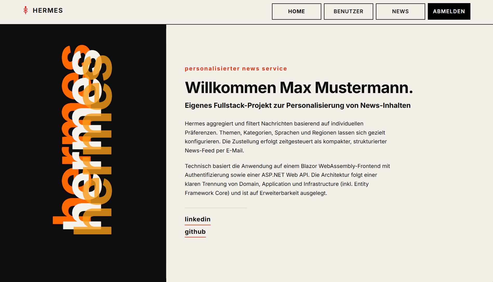

*After login, users land on **Home** (`AppHomeLayout`): welcome text, Swiss poster backdrop, and **top navigation** toward profile and news settings.*

### Login (`/login`)

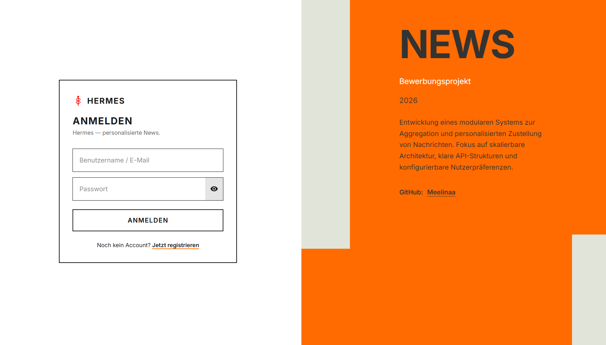

*The **login** route calls `POST /api/v1/auth/login`; access and refresh tokens are stored in **local storage** (`AuthLayout` + `AuthSwissPoster`, `AuthTokenStore`).*

### Registration (`/register`)

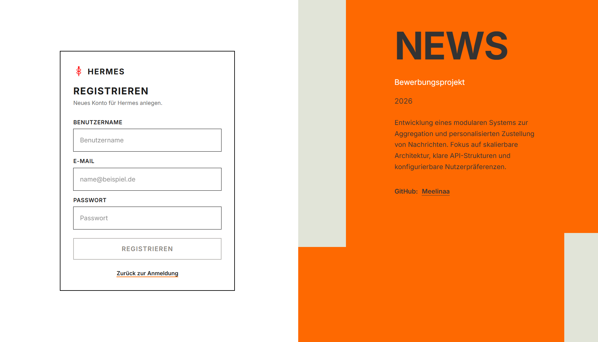

*Empty **registration** form. The file committed to the repo is still named **`RestisterPage.png`** (typo). Flow: `POST /api/v1/users`, then automatic login and redirect to `/home`.*

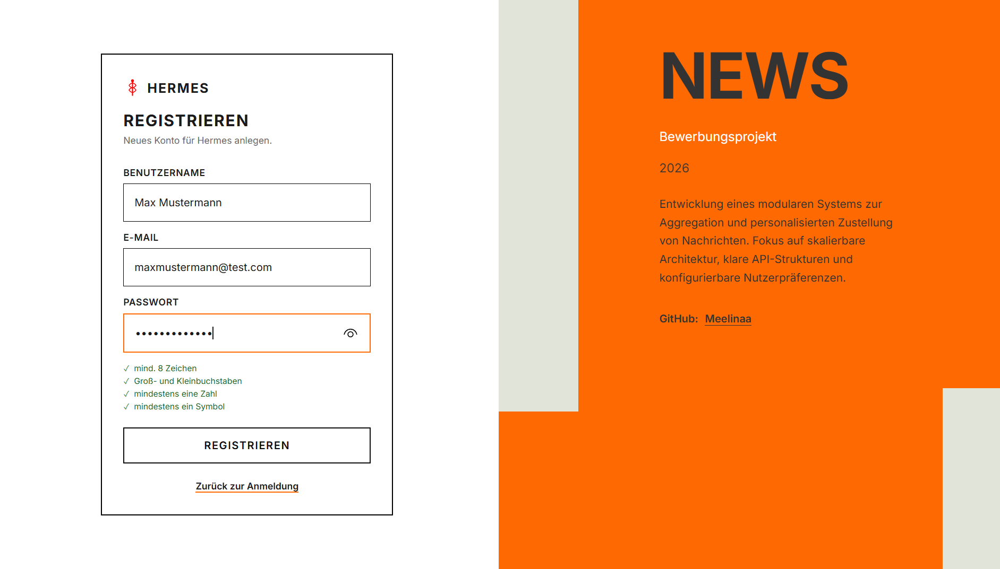

*Filled example useful for validating password rules, API errors, and the full registration UX.*

### E-mail verification (UI + local SMTP capture)

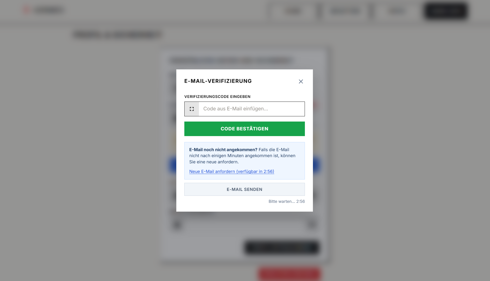

*Triggered from **`/user-settings`**; submits the code with `POST /api/v1/users/verify/code`. Resend and cooldown semantics follow the API behavior described under **Routing**.*

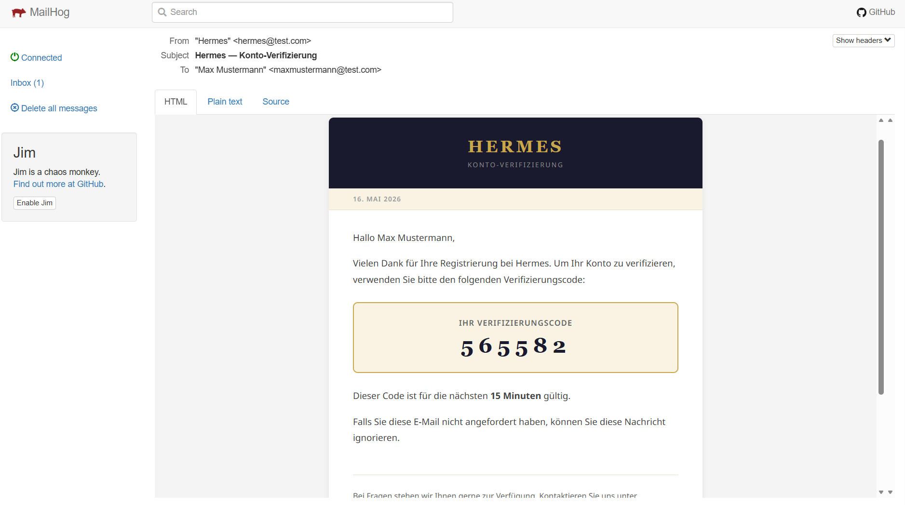

*This is **not** a Blazor screenshot—it shows **MailHog** (local SMTP sink): the outbound **verification email** composed by `Hermes.Notifications` during local debugging without a real mailbox.*

### News digest profiles (`/news-settings`, `/news-settings/new`)

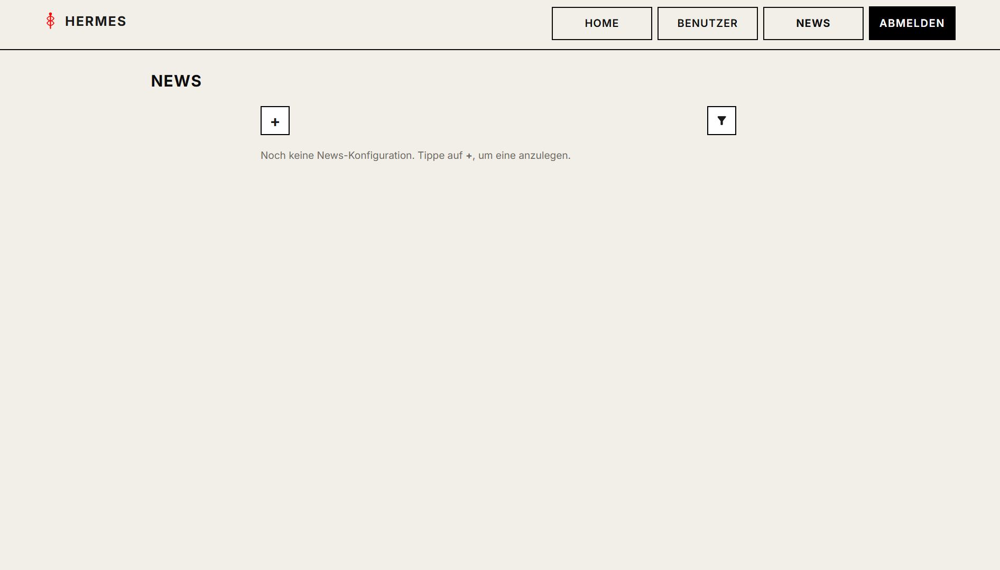

_**`NewsSettingsPanel`** exposes a focused empty state with a clear call-to-action when the authenticated user still has zero `News` rows._

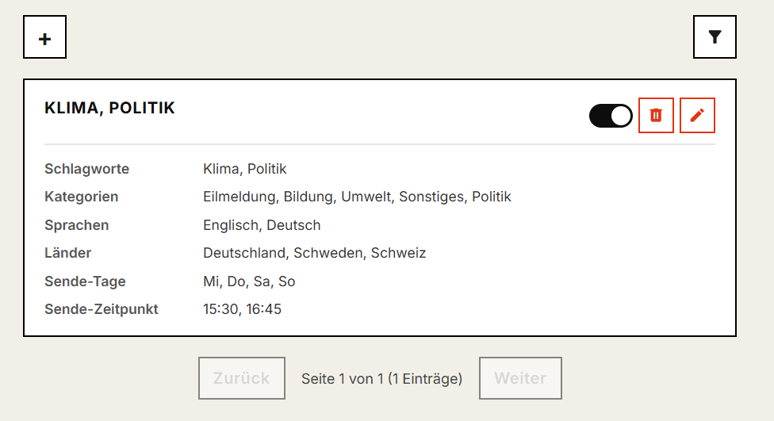

*Configured profiles rendered as **`NewsSubscriptionCard`** tiles; backed by paginated `GET …/news`.*

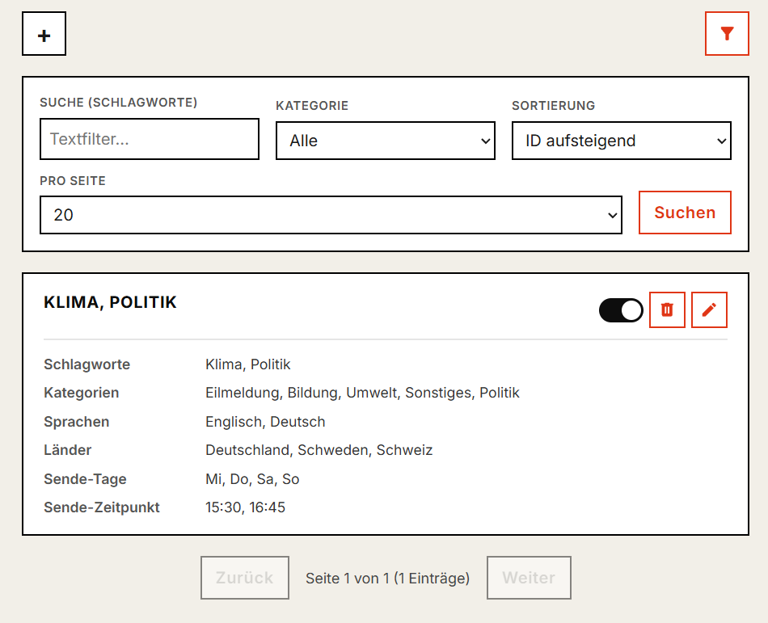

*Same screen with filtering—the client forwards query parameters built by **`NewsSubscriptionListCache`**.*

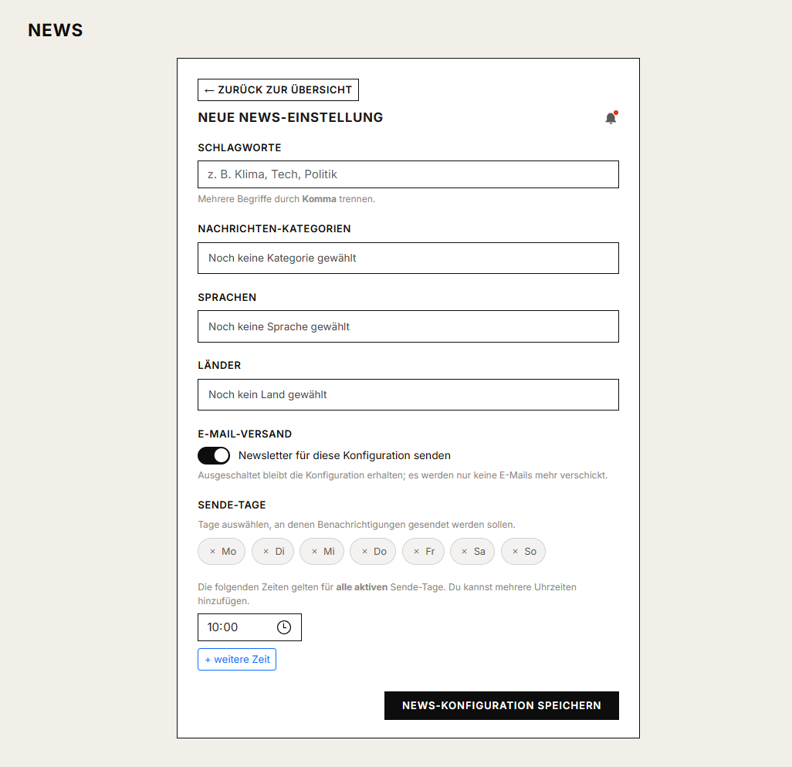

*Creating or editing a profile: keywords, languages/countries, categories, plus **weekdays & send times** for delivery.*

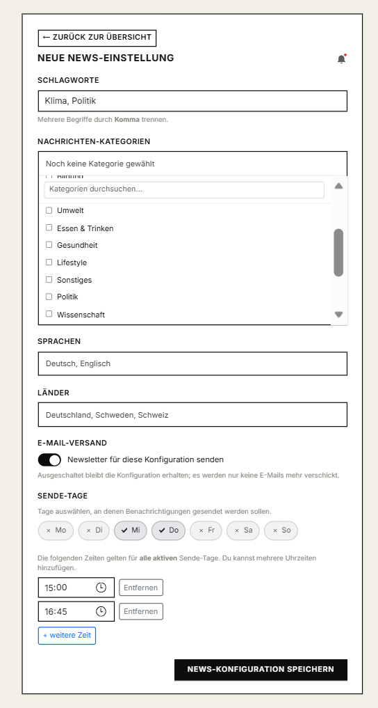

*Realistic fixture for manual/demo validation of **`POST` / `PUT`** news mutations.*

### User profile (`/user-settings`)

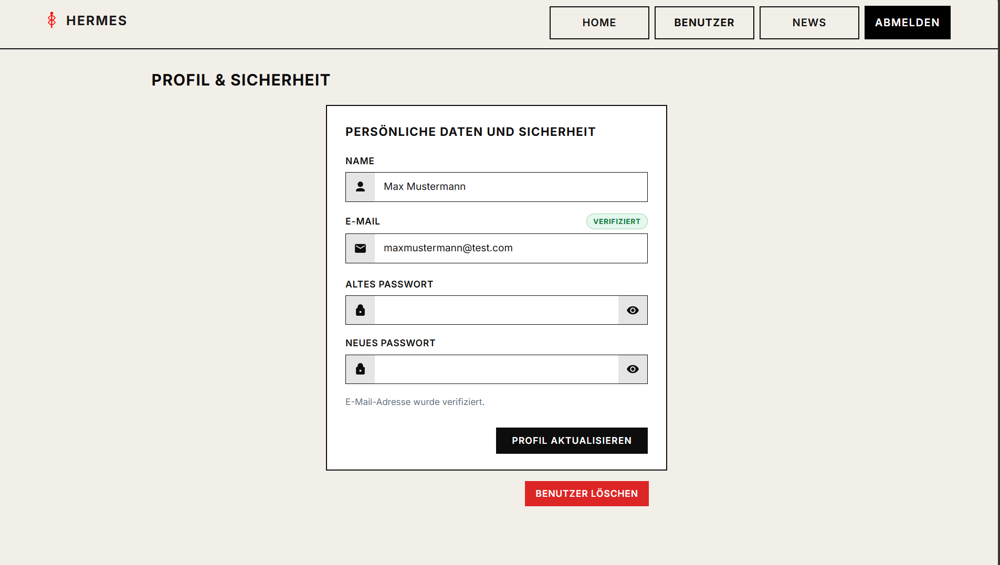

*When **`UserScope.isEmailVerified`** is **true**, the UI shows verified email status (badge / calm baseline state).*

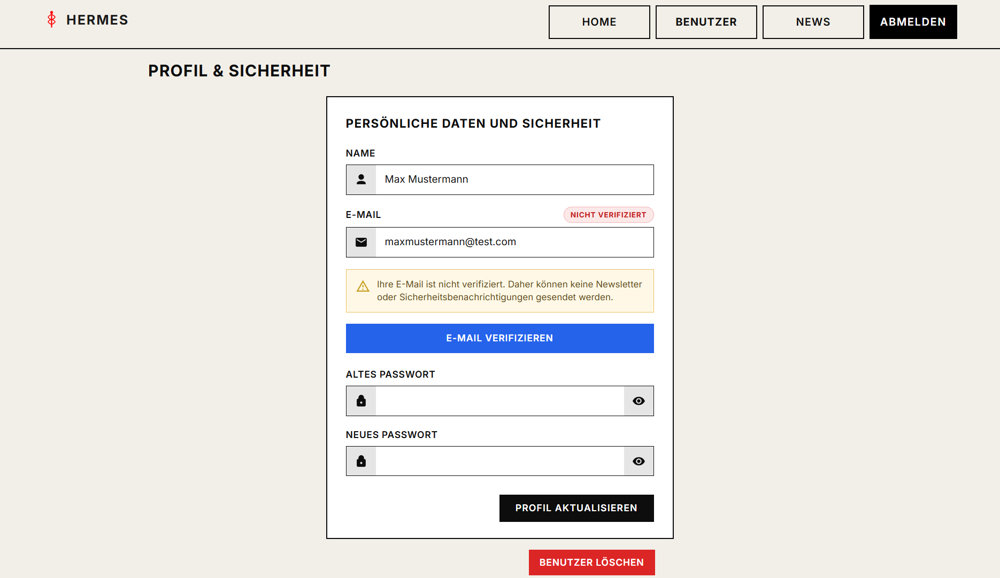

*Warning + verification actions remain until e-mail succeeds. Repo filename: **`UserSettingsNotVerfiedMail.png`** (typo *Verfied*).*

### Generated newsletter preview (MailHog or browser tools)


*Output assembled by **`NewsletterHtmlComposer`**, usually inspected inside **MailHog** or dev tools—header, repeating article rows, and footer. Repo filename: **`NewsMailSneekPeek.png`** (*SneekPeek*).*

### Raw MIME sample (not a PNG)

Open [`../Documentation/ExampleMail.eml`](../Documentation/ExampleMail.eml) without the UI shell to inspect headers, multipart structure, and the HTML part emitted by the same pipeline.

---

## Notable client services

| Service | Purpose |
|---------|---------|
| `UserProfileRefreshNotifier` | Singleton: after saving profile, notify other views (e.g. reload home welcome line). |
| `NewsSubscriptionListCache` | Builds paged `GET …/news` requests (query: page, pageSize, sort, filters); no response cache. |

---

## Known limitations

- **Blazor UI:** `Hermes.WebFrontend.Client.Tests` (bUnit) covers selected components; heavier flows stay in API integration tests.

---

## Folder layout

```
Hermes.WebFrontend/
├── README.md                         ← this file
├── Hermes.WebFrontend.Client.Tests/ ← bUnit (component tests)
├── Hermes.WebFrontend/               ← server host
│   ├── Components/           App.razor, Routes, Layout/MainLayout, Pages (Error, NotFound)
│   ├── wwwroot/              global CSS, tokens
│   └── Program.cs
└── Hermes.WebFrontend.Client/
    ├── Components/           auth, news, navigation, …
    ├── Layout/               AuthLayout, AppHomeLayout
    ├── Pages/                Login, Register, Home, UserSettings, NewsSettings, RootRedirect
    ├── Services/             auth, news, user, …
    ├── wwwroot/appsettings*.json
    └── Program.cs
```

---

## Automated tests

**`Hermes.WebFrontend.Client.Tests`** (bUnit) exercises key Blazor components (e.g. `HermesBrand`). Backend paths the UI relies on (**auth**, **users**, **news**, **notification logs**) are covered by **`Hermes.IntegrationTests`** and **`Hermes.UnitTests`** (see [`Hermes.Api/README.md`](../Hermes.Api/README.md)).

Run all solution tests from the repository root:

```bash
dotnet test Hermes.slnx
```

Docker-backed API integration tests only:

```bash
dotnet test Hermes.slnx --filter "Integration=Docker"
```

---

## Build

```bash
dotnet build Hermes.WebFrontend/Hermes.WebFrontend/Hermes.WebFrontend.csproj
```

The client assembly builds as a dependency. **`dotnet build Hermes.slnx`** (from the repo root) builds the frontend together with the API, worker, and test projects.
