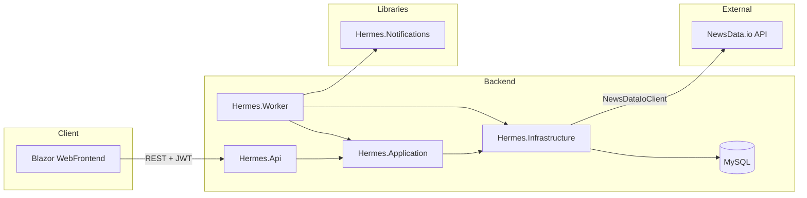

# Hermes

Hermes is a **personal news digest service**. The idea is that you configure **who you are** and **what news you care about** once—through a **Blazor web frontend** (interactive UI wired to the API)—and the system persists that configuration in a database via a **REST API**. On a **schedule** you define (weekdays and times), the **`Hermes.Worker`** background host (Hangfire + MySQL job storage) fetches matching articles from a **third-party news API** (**[NewsData.io](https://newsdata.io/)** — HTTP integration in **`Hermes.Infrastructure`**, with a standalone **`Hermes.NewsClient`** library still in the repo for reference/experiments), composes an **HTML email** using a dedicated layout, and sends it so you receive **regular, predictable** news by mail. Hermes does not own the news corpus; it **calls NewsData.io’s HTTP API** (e.g. the **latest** endpoint) using your API key and the filters derived from each user’s saved profile.

The codebase is intentionally structured for **clarity and maintainability**: layered architecture, explicit domain models, validation at the API boundary, and separate libraries for **news HTTP access** and **email delivery**. **Automated tests** are planned as the surface area stabilizes. **Docker** is the intended packaging and deployment story for running the API, database, frontend, and **worker** together.

For **HTTP route details, request/response examples, and OpenAPI notes**, see `[Hermes.Api/README.md](Hermes.Api/README.md)`.

---

## Product vision (end state)

1. **Web UI**: Sign in, manage account basics, and edit one or more **news profiles** per user (keywords, categories, languages, countries, send days, send times).
2. **API + database**: The UI talks to **Hermes.Api**; settings are validated and stored as structured entities (not ad hoc JSON blobs where avoidable).
3. **Scheduled delivery**: **`Hermes.Worker`** runs as an **always-on .NET Worker Service** with **Hangfire** (MySQL storage). It runs a **minutely** recurring job that resolves due profiles, enqueues per-profile digest jobs, calls **NewsData.io** via **`Hermes.Infrastructure`**, fills the **HTML newsletter templates** (`**Hermes.Notifications**`), sends email via **SMTP**, and records outcomes in **notification logs**. The API can **trigger** the same Hangfire recurring job after news mutations when worker and API share job storage.

This is **not** a browser “Service Worker” in the PWA sense. Service workers run in the client and cannot replace a server-side worker with database access, API keys, and SMTP credentials.

---

## Repository layout and responsibilities

The solution is organized into focused projects:


| Project                                                | Responsibility                                                                                                                                                                                                                                                                                                                                                                       |
| ------------------------------------------------------ | ------------------------------------------------------------------------------------------------------------------------------------------------------------------------------------------------------------------------------------------------------------------------------------------------------------------------------------------------------------------------------------ |
| **Hermes.Domain**                                      | Core **entities** (`User`, `News`, `NotificationLog`), **DTOs**, **enums** (categories, languages, countries, weekdays, delivery channel, notification status), and **abstractions** the application depends on.                                                                                                                                                                     |
| **Hermes.Application**                                 | **Use cases** and **services** (users, authentication, news configuration, etc.) that orchestrate domain rules and call into persistence through interfaces.                                                                                                                                                                                                                         |
| **Hermes.Infrastructure**                              | **Entity Framework Core** with **Pomelo.EntityFrameworkCore.MySql**; **repositories**; `HermesDbContext`; resilience helpers (e.g. **Polly**) where appropriate. The database is **MySQL**.                                                                                                                                                                                          |
| **Hermes.Api**                                         | **ASP.NET Core** host: controllers, **JWT** authentication, **FluentValidation**, global exception handling mapped to **Problem Details**, **health** endpoints (live/ready), **CORS** and DI composition. OpenAPI is available in **Development**.                                                                                                                                  |
| **Hermes.NewsClient**                                  | Typed **HTTP client** for the external **[NewsData.io](https://newsdata.io/)** REST API (**latest** news): URL construction (`NewsDataIoUrlBuilder`), query parameters (`ApiUrlParts` — API key, countries, languages, categories, timezone, sort, optional flags), deserialization DTOs, `NewsDataIoClient.GetLatestAsync`. This is the **live news source** Hermes talks to today. |
| **Hermes.Notifications**                               | **Email sending** (`IEmailSender`, `SmtpEmailSender` using `System.Net.Mail.SmtpClient`), configuration models, and **HTML newsletter composition** (`NewsletterHtmlComposer`) from **embedded** partial templates (header, repeating item row, footer).                                                                                                                             |
| **Hermes.Worker**                                      | **.NET Worker Service** hosting **Hangfire** (MySQL): minutely **newsletter scheduler**, background **digest jobs**, shared application services with the API. Configuration for DB, NewsData.io, SMTP, optional MailHog test mail. See `[Hermes.Worker/README.md](Hermes.Worker/README.md)`.                                                                                         |
| **Hermes.WebFrontend** / **Hermes.WebFrontend.Client** | **Blazor Web App** (.NET 10) with **Interactive WebAssembly**: authentication (login, register + auto-login), JWT/refresh via `HttpClient`, home, user profile, and CRUD UI for **news digest profiles**. See `[Hermes.WebFrontend/README.md](Hermes.WebFrontend/README.md)`.                                                                                                        |
| **Hermes**                                             | Small **console** executable (currently oriented around **Notifications**)—useful as a **local playground**. It is **not** the production scheduler; use **`Hermes.Worker`** for scheduled digests.                                                                                                                                                                                    |





---

## What is already implemented (and how)

### Authentication and users

- **Registration** and **user** CRUD-style operations are exposed from the API and implemented through application services and EF-backed repositories.
- **Login** returns a **short-lived JWT** access token and an **opaque refresh token**. Refresh tokens are stored **hashed** server-side; rotation is supported via a dedicated **refresh** endpoint. **Logout** can revoke the current refresh session or all sessions for the user.
- JWT signing and validation settings live under configuration (e.g. `Jwt` in `appsettings`); production secrets should be supplied via **environment variables** or a secret store, not committed files.

### Personalized news configuration (`News` entity)

Each row represents a **digest profile** for a user, including:

- **Keywords**, **categories**, **languages**, **countries** (aligned with domain enums and API JSON as string enums where applicable).
- **SendOnWeekdays** and **SendAtTimes** — the data model captures *when* a digest should run; **`Hermes.Worker`** (via `INewsletterScheduleService` / `INewsletterDigestService`) evaluates due rows and sends mail (see `[Hermes.Worker/README.md](Hermes.Worker/README.md)`).

The API exposes **list**, **get by id**, **create**, **update**, and **delete** (including delete-all for a user) under versioned routes. Authorization ensures callers can only access their own user’s data where applicable.

### Notification logs

- A **notification log** entity tracks **sent-at** time, **status**, **channel** (e.g. email), optional **error message**, **retry** metadata, etc.
- The API can **append** log entries so the delivery pipeline (once implemented) can record success, failure, and retries for observability and debugging.

### Third-party news API: NewsData.io (`Hermes.NewsClient`)

Hermes already integrates with **[NewsData.io](https://newsdata.io/)** as the **external news provider**. That service exposes a documented **REST** surface; this repository implements the client side only.

- `**NewsDataIoUrlBuilder`** builds the **GET** URL for the **latest** feed (base URL `https://newsdata.io/api/1/latest` with query string).
- `**ApiUrlParts`** carries everything needed for that request: **API key** (required), optional **countries**, **languages**, **categories**, **timezone**, **sort**, image / dedupe flags, and **field exclusion** defaults tuned for lighter payloads.
- `**NewsDataIoClient.GetLatestAsync`** executes the request and deserializes the JSON into DTOs (`NewsDataIoDto` / result rows).

The **Hermes.Api** stores *what* to ask for per user (`News` entity: keywords, categories, languages, countries, schedule). **`Hermes.Worker`** translates due rows into NewsData.io requests (via **`Hermes.Infrastructure`**), maps articles into **`NewsletterItemContent`**, and hands off to the mail composer. The standalone **`Hermes.NewsClient`** project remains available for experiments; the running pipeline uses the infrastructure client.

### Web frontend (`Hermes.WebFrontend`)

- **Stack:** Blazor **Web App** host + **WebAssembly** client; API base URL from client `wwwroot/appsettings.json` (`ApiBaseUrl`).
- **Auth:** Login and registration call `api/v1/auth/login` and `api/v1/users`; tokens stored in **browser local storage**; `AuthMessageHandler` attaches Bearer tokens; **refresh** and session idle handling on the client.
- **Routes (examples):** `/` (redirect), `/login`, `/register`, `/home`, `/user-settings`, `/news-settings` (and `/news-settings/new` for create).
- **UI:** Swiss-style poster chrome (main layout, home rail, auth side panel), top navigation for authenticated areas, `GlobalAuthGuard` for protected navigation.
- **CORS:** The API must list the Blazor dev origin (e.g. `http://localhost:5269`) under `Cors:AllowedOrigins`—see `[Hermes.WebFrontend/README.md](Hermes.WebFrontend/README.md)`.

### Email and HTML layout (`Hermes.Notifications`)

- **SMTP** delivery is abstracted behind `IEmailSender` with a concrete `SmtpEmailSender` taking **host, port, SSL, credentials, from/reply-to**, etc.
- **NewsletterHtmlComposer** loads **embedded** HTML fragments (`NewsletterHeader.html`, `NewsletterItem.html`, `NewsletterFooter.html`), substitutes placeholders, repeats the item template per article, and returns a **single HTML document** suitable for `IsBodyHtml` email.
- Together, this is the **presentation layer** for the digest email; **`Hermes.Worker`** feeds it **live article data** on the configured schedule.

### Scheduled delivery (`Hermes.Worker`)

- **Hangfire** recurring job (minutely by default in code) loads due digest profiles and enqueues **one background job per matching `(userId, newsId)`** (multiple profiles for the same user at the same time produce **separate** emails).
- **Shared MySQL** is used for Hermes data and (by default) Hangfire storage so **`Hermes.Api`** can trigger the scheduler after news CRUD for faster local feedback.
- **SMTP** configuration matches **`Hermes.Notifications`**; local dev often uses **MailHog** (see `[Hermes.Worker/README.md](Hermes.Worker/README.md)`).

### API quality and operations

- **FluentValidation** for input; failures return **400** with `ValidationProblemDetails`.
- A **global exception handler** maps domain and infrastructure failures to appropriate status codes (**403**, **404**, **409**, etc.) without leaking internal details in production-oriented responses.
- **Health checks**: **liveness** and **readiness** (readiness includes the database) for orchestration and future container deployments.

---

## What is not implemented yet (by design)

- **Production hardening of scheduling**: The worker uses a **minutely** Hangfire tick; production may want tuned cron, explicit **per-user time zones**, back-pressure, and stronger **idempotency** / dead-letter handling beyond the current design.
- **Email verification flow**: Not fully productized end-to-end in the UI (API/domain may already expose related fields).
- **Tests**: **Unit tests** for schedule/digest logic and **integration tests** for API + database + worker paths are still open; the solution has **no test projects** committed yet.

---

## Roadmap (high level)

1. **Frontend polish**: Hardening (tests, a11y), optional session/refresh-token cleanup UX, and any remaining flows (e.g. email verification). Details: `[Hermes.WebFrontend/README.md](Hermes.WebFrontend/README.md)`.
2. **Worker / scheduler polish**: Time-zone strategy, production cron/scale-out story, retries and alerting; optional **Dockerfile** for `Hermes.Worker` alongside the API.
3. **Configuration & secrets**: SMTP settings, NewsData API key, connection strings, JWT keys—standardized for **Development** vs **Production**, all overrideable via environment variables.
4. **Testing**: Unit tests for composition and scheduling logic; integration tests for API and persistence; optional contract tests against OpenAPI.
5. **Docker**: `Dockerfile`(s) for API, worker, and static/Blazor hosting; **docker-compose** with MySQL, optional **MailHog** (or similar) for local SMTP capture, and documented ports/volumes.

---

## Docker and deployment intent

The target runtime is **containerized**:

- **Hermes.Api** as one (or more) API container(s) behind a reverse proxy if needed.
- **MySQL** (or compatible) as a database container with persisted volume.
- **Hermes.WebFrontend** served from its container or static hosting, configured with the API base URL.
- A **worker** container (`Hermes.Worker`) with the same configuration surface (connection string, SMTP, news API key) but without public HTTP, or with only health/metrics if desired.

Exact compose files and images are **not** committed yet; this README states the **direction** so new work (CI, compose, K8s manifests) stays consistent.

---

## Quality bar

The author aims to keep Hermes at a **solid engineering level**: clear boundaries between layers, typed APIs, validation and error contracts suitable for a real client, and reusable libraries for **news** and **mail** so the scheduler remains thin. Documentation (this file, `[Hermes.Api/README.md](Hermes.Api/README.md)`, `[Hermes.Worker/README.md](Hermes.Worker/README.md)`) should stay close to what the code actually does.

---

## Building and running (brief)

Requirements: **.NET SDK** matching the solution target (currently **.NET 10** in project files), and a **MySQL** instance configured in `Hermes.Api` settings for local runs.

```bash
dotnet build Hermes.slnx
```

Run the API from the `Hermes.Api` project directory (set `ASPNETCORE_ENVIRONMENT=Development` for OpenAPI). See `[Hermes.Api/README.md](Hermes.Api/README.md)` for endpoint summaries and `GET /openapi/v1.json` in Development.

Run the Blazor app from `Hermes.WebFrontend/Hermes.WebFrontend` (`dotnet run`). Configure `ApiBaseUrl` and CORS as described in `[Hermes.WebFrontend/README.md](Hermes.WebFrontend/README.md)`.

Run the worker from `Hermes.Worker` (`dotnet run`) with MySQL, NewsData.io, and SMTP (or MailHog) configured—details in `[Hermes.Worker/README.md](Hermes.Worker/README.md)`.