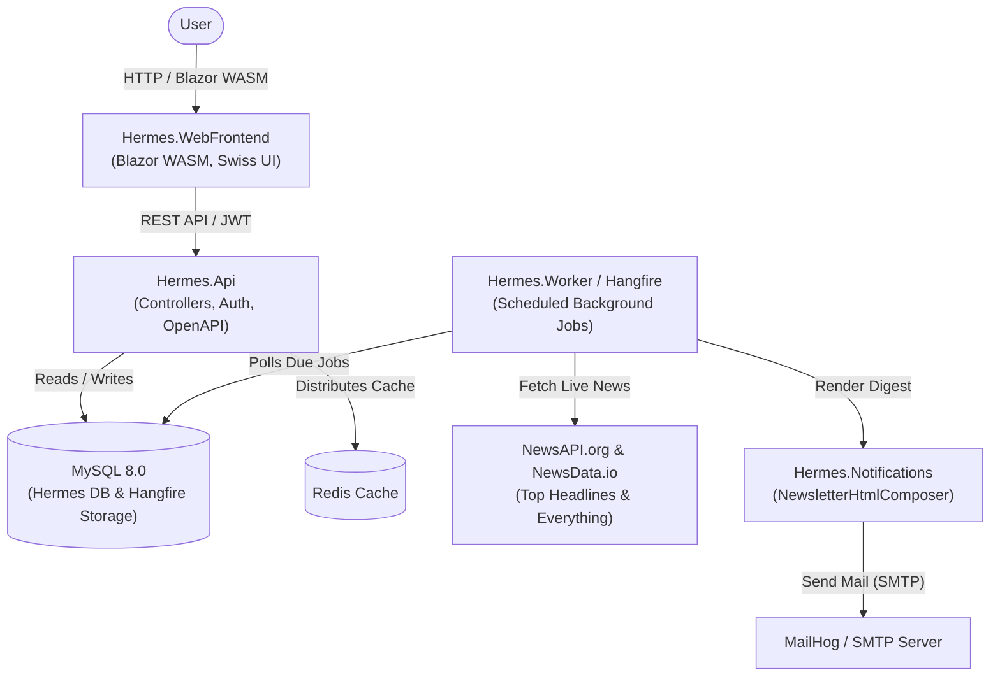

<div align="center">
  

  # Hermes
  
  **A performant, personalized news digest service for tailored news updates.**

  [](https://github.com/meelinaa/Hermes/actions/workflows/ci-cd.yml)
  
  
  
  
  
</div>

<br />

Hermes solves the problem of daily information overload: Using a modern **Blazor Web-Frontend**, you precisely configure **which** news you care about (keywords, countries, languages, categories) and **when** you want to receive them. 

Behind the scenes, a robust **.NET 10 Hexagonal Architecture** takes care of the rest: A dedicated background worker fetches the relevant articles on schedule via *NewsAPI.org* & *NewsData.io*, generates clean, responsive HTML emails, and reliably delivers them to your inbox via SMTP.

---

## ✨ Features at a Glance

- **Interactive Live Feed Explorer (`/feed`):** Search and filter real-time global news across multiple categories, languages, and countries with instant previews and direct one-click conversion into automated email digests.
- **Personalized Digest Profiles (`/news-settings`):** Subscribe to unlimited customized topics (e.g., "AI and Cloud Computing", "Economy in Europe") and tailor your news streams to your exact interests.
- **Granular Dispatch Schedules:** Define exact delivery days of the week and multiple daily delivery times per subscription profile.
- **Swiss Poster Design System:** High-contrast, responsive typography with seamless light and dark mode toggling.
- **Secure Identity & Verification:** Full profile control with JWT authentication, BCrypt password hashing, refresh token rotation, and 6-digit email ownership verification.
- **Responsive HTML Email Newsletters:** Structured, beautifully formatted email digests with full deep-link article references delivered via background workers.
- **Complete Observability & Audit Logs:** Structured Serilog logging, correlation ID tracing, OpenTelemetry metrics, and complete notification dispatch audit logs.

---

## 🏗️ Architecture & Design

Hermes is built as a modular, decoupled system following the **Hexagonal Architecture (Ports and Adapters)** pattern.


```mermaid
flowchart TD
    User(["User"]) -->|"HTTP / Blazor WASM"| Web["Hermes.WebFrontend\n(Blazor WASM, Swiss UI)"]
    Web -->|"REST API / JWT"| API["Hermes.Api\n(Controllers, Auth, OpenAPI)"]
    
    API -->|"Reads / Writes"| DB[("MySQL 8.0\n(Hermes DB & Hangfire Storage)")]
    API -->|"Distributes Cache"| Redis[("Redis Cache")]
    
    Worker["Hermes.Worker / Hangfire\n(Scheduled Background Jobs)"] -->|"Polls Due Jobs"| DB
    Worker -->|"Fetch Live News"| NewsAPI["NewsAPI.org & NewsData.io\n(Top Headlines & Everything)"]
    Worker -->|"Render Digest"| Notif["Hermes.Notifications\n(NewsletterHtmlComposer)"]
    Notif -->|"Send Mail (SMTP)"| MailHog["MailHog / SMTP Server"]
```

### Key Architectural Decisions
- **Hexagonal Architecture (Ports & Adapters):** Domain entities (`Hermes.Domain`) and business use cases (`Hermes.Application`) are strictly isolated from third-party libraries and storage mechanisms. Infrastructure implementations (`Hermes.Infrastructure`) implement inbound and outbound ports as pluggable adapters.
- **Hangfire Scheduler with MySQL Storage:** Background email dispatches are scheduled and processed through Hangfire, backed by MySQL for persistence and automatic retries.
- **Dynamic News Provider Integration:** The news client dynamically routes requests between `/v2/top-headlines` (for category and country queries) and `/v2/everything` (for full-text keywords and languages), passing full article deep links to the digest pipeline.
- **Decoupled Blazor WebAssembly Client:** The frontend runs client-side in the browser, using a dedicated MVVM pattern and communicating exclusively with the REST API.
- **Built-in Observability:** Default integration of structured logging (Serilog), correlation IDs, health checks (`/health/live`, `/health/ready`), and OpenTelemetry support.

### Project Structure
- **`Hermes.Domain`:** Core business entities (`User`, `NewsletterSubscription`, `NotificationLog`), value objects (`UserId`, `NewsletterId`, `EmailAddress`), and enums.
- **`Hermes.Application`:** Use cases, service contracts (inbound/outbound ports), DTOs, and scheduling orchestration.
- **`Hermes.Infrastructure`:** Persistence adapters (EF Core MySQL `HermesDbContext`, repositories), external news clients (NewsAPI.org / NewsData.io adapters), and BCrypt password hasher.
- **`Hermes.Api`:** REST API endpoints, JWT token provider, authorization policies, FluentValidation, and OpenAPI specifications.
- **`Hermes.Worker`:** Background host managing Hangfire queues, recurring jobs, and automated digest dispatching.
- **`Hermes.Notifications`:** HTML email composition (`NewsletterHtmlComposer`, `VerificationHtmlComposer`) and SMTP email delivery.
- **`Hermes.WebFrontend`:** Blazor WebAssembly client application featuring the Swiss Poster design system, MVVM architecture, and live feed explorer.

---

## 📸 Implementation Breakdown & Walkthrough

> [!TIP]
> **Universal Dark Mode Support:** All user interfaces across Hermes (Authentication, Home Dashboard, Live Feed, Subscription Management, and Profile Settings) feature a unified **Swiss Poster Design System** with instant **Light & Dark Mode** switching via the top navigation bar (`ThemeToggle`), automatically persisted in browser storage and synchronized with system preferences.

### 1. Authentication & User Management
- **Registration & Login:** Secure authentication with short-lived JWT tokens and opaque refresh token rotation, styled in both light and dark poster layouts.
- **Email Verification:** Six-digit security codes with automated verification emails and resend cooldowns.
- **Profile Security:** Password updates verified against current password hashes with BCrypt.


---

### 2. Home Dashboard (`/home`)
- Authenticated dashboard featuring the Swiss Poster typography rail, top navigation with one-click **Light/Dark Mode** theme toggle, and personalized greetings.


---

### 3. Interactive Live Feed Explorer (`/feed`)
- Real-time search across global news sources with multi-select filters for categories, languages, and countries, optimized with high-contrast cards in both **Light and Dark Mode**.
- Direct **"Save as Newsletter Subscription"** modal enabling users to convert any live search query into a scheduled email digest with custom weekday and time settings.

---

### 4. Personalized News Settings (`/news-settings`)
- Overview of all active and inactive subscription profiles with pagination (10/20/50 items per page), keyword search, category sorting, and dark mode styling.
- Form editor for configuring delivery schedules (weekdays and daily timeslots).


---

### 5. User Profile Settings (`/user-settings`)
- Profile overview displaying account status, email verification badge, theme preferences, and password change form (supporting light and dark modes).


---

### 6. Email Rendering & Dispatch Pipeline (`Hermes.Notifications`)
- Newsletters are compiled as responsive, modern HTML emails featuring publication headers, categories, summaries, and direct article links.
- Local email delivery is captured and inspectable via MailHog.


Sample raw MIME artifact: **[`Documentation/ExampleMail.eml`](Documentation/ExampleMail.eml)**.

---

## 🚀 Quick Start (Getting Started)

Hermes supports both an **all-in-one local dev runner** (hybrid mode with hot reload) and a **full Docker Compose** deployment.

### Prerequisites
- **[.NET 10 SDK](https://dotnet.microsoft.com/download/dotnet/10.0)**
- **[Docker Desktop](https://www.docker.com/products/docker-desktop/)**
- An API key from **[NewsAPI.org](https://newsapi.org/)** or **[NewsData.io](https://newsdata.io/)**

---

### Option A: Hybrid Dev Runner (Recommended for Development)

The repository includes a single-command dev runner that starts Docker infrastructure (MySQL, Redis, MailHog), applies database migrations, and launches all .NET services with `dotnet watch` hot reload:

**PowerShell (Windows):**
```powershell
./dev.ps1
```

**Command Prompt / Windows CMD:**
```cmd
dev.cmd
```

**Useful Runner Commands:**
- `./dev.ps1 -Status` : Inspect health of all running containers and services.
- `./dev.ps1 -Stop`   : Stop all local services and background processes.

---

### Option B: Full Docker Compose Setup

1. **Clone the repository**
   ```bash
   git clone https://github.com/meelinaa/Hermes.git
   cd Hermes
   ```

2. **Configure environment variables**
   ```bash
   cd Docker
   cp .env.example .env
   # Edit .env and enter your News API key and JWT secret
   ```

3. **Start backend & database via Docker**
   ```bash
   docker compose up -d --build
   ```

4. **Start the Web Frontend (Blazor)**
   ```bash
   cd ../Hermes.WebFrontend/Hermes.WebFrontend
   dotnet run
   ```

---

### Service URLs & Dashboards

| Service | URL | Description |
|---|---|---|
| **Frontend Web App** | `https://localhost:7016` | Blazor WASM Client |
| **Backend REST API** | `http://localhost:5165` / `https://localhost:7017` | ASP.NET Core API |
| **Swagger / OpenAPI** | `http://localhost:5165/swagger` | Interactive API Documentation |
| **Worker Hangfire Dashboard** | `http://localhost:5166/hangfire` | Background Job Monitor |
| **MailHog Inbox** | `http://localhost:8025` | Local SMTP Email Viewer |
| **MySQL Database** | `localhost:3308` | Database: `hermes` |
| **Redis Cache** | `localhost:6379` | Distributed Cache |

---

## ⚙️ Configuration & Environment Variables

Hermes can be configured via environment variables, `.env` files, or `appsettings.json`.

| Key / Environment Variable | Type | Default | Required | Description |
|---|---|---|---|---|
| `ConnectionStrings__DefaultConnection` | String | `""` | **[Required]** | MySQL connection string for application and Hangfire storage. |
| `Jwt__SigningKey` | String | `""` | **[Required]** | Secret signing key (min. 32 characters) for JWT token signing. |
| `NewsDataIo__Key` / `NewsApi__Key` | String | `""` | **[Required]** | API key from NewsAPI.org or NewsData.io for fetching news articles. |
| `Email__Host` | String | `"localhost"` | Optional | SMTP hostname (`localhost` for MailHog). |
| `Email__Port` | Integer | `1025` | Optional | SMTP port (`1025` for MailHog). |
| `OpenApi__DocumentationApiKey` | String | `""` | Optional | Key to restrict OpenAPI documentation access in production. |
| `Pagination__DefaultPageSize` | Integer | `20` | Optional | Default page size for paginated API responses. |

### Local Secrets Setup (.NET User Secrets)
```bash
dotnet user-secrets set "Jwt:SigningKey" "DEV_LOCAL_SIGNING_KEY_MIN_32_CHARS_LONG_SECRET" --project Hermes.Api
dotnet user-secrets set "NewsDataIo:Key" "your_news_api_key_here" --project Hermes.Api
dotnet user-secrets set "NewsDataIo:Key" "your_news_api_key_here" --project Hermes.Worker
```

---

## 🧪 Testing & Quality Assurance

The solution includes comprehensive unit and integration test suites covering the domain, application services, controllers, and Blazor UI components.

```bash
# Run all unit and integration tests across backend and frontend
dotnet test Hermes.UnitTests/Hermes.UnitTests.csproj
dotnet test Hermes.WebFrontend/Hermes.WebFrontend.Client.Tests/Hermes.WebFrontend.Client.Tests.csproj
dotnet test Hermes.IntegrationTests/Hermes.IntegrationTests.csproj
```

**Test Suite Coverage (828 Tests Total):**
- **Backend Unit Tests (`Hermes.UnitTests`):** 624 automated tests covering domain validation, user authentication, JWT lifecycle, newsletter scheduler logic, and News API URL construction.
- **Frontend Component Tests (`Hermes.WebFrontend.Client.Tests`):** 109 bUnit tests validating Blazor WASM UI components, theme switching, filters, and ViewModels.
- **Integration Tests (`Hermes.IntegrationTests`):** 95 end-to-end API and database integration tests using [Testcontainers](https://dotnet.testcontainers.org/) for automated ephemeral MySQL and Redis test instances.

---

## 📄 License

This project is licensed under the MIT License — see the [LICENSE](LICENSE) file for details.
