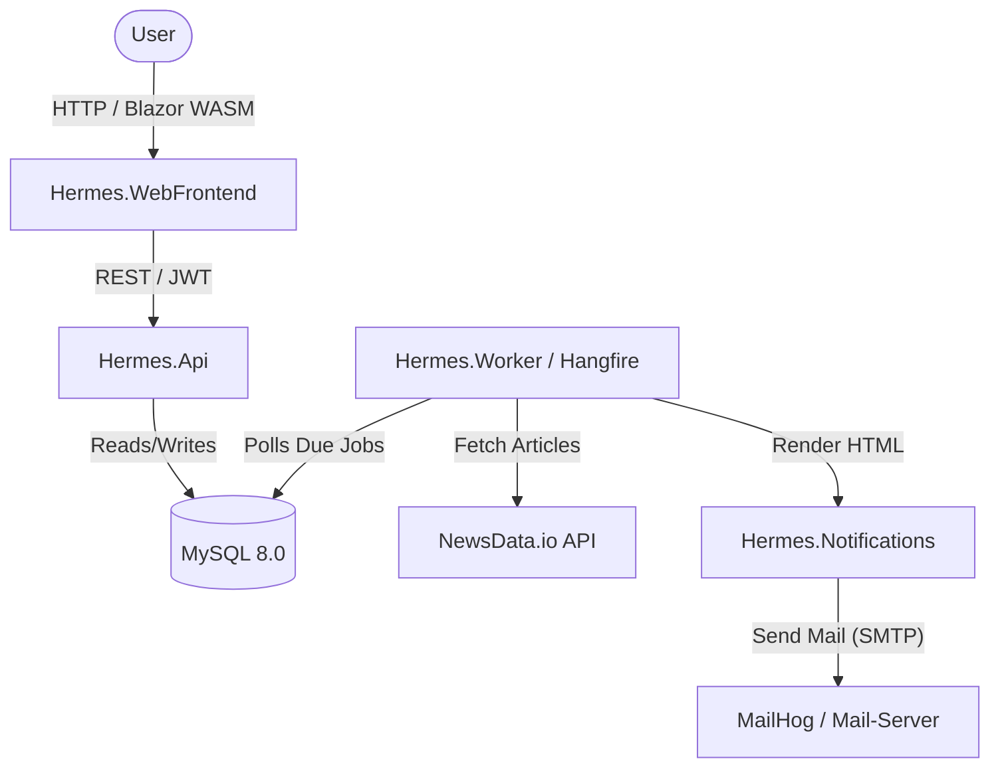

<div align="center">
  

  # Hermes
  
  **A performant, personalized news digest service for tailored news updates.**

  [](https://github.com/meelinaa/Hermes/actions/workflows/ci-cd.yml)
  
  
  
  
  
</div>

<br />

Hermes solves the problem of daily information overload: Using a modern **Blazor Web-Frontend**, you precisely configure **which** news you care about (keywords, countries, languages) and **when** you want to receive them. 

Behind the scenes, a robust **.NET 10 Hexagonal Architecture** takes care of the rest: A dedicated worker fetches the relevant articles right on time via *NewsData.io*, generates a clean HTML email, and reliably delivers it to your inbox via SMTP.

---

## ✨ Features at a Glance

- **Personalized Feeds:** Subscribe to unlimited topics (e.g. "Tech News in English", "Economy in Austria") and tailor your news feed exactly to your interests.
- **Precise Timing:** You decide exactly on which days of the week and at what exact time your digest should arrive.
- **Secure Account Management:** Full control over your profile with secure login (JWT), password hashing (BCrypt), and email verification flows.
- **Beautiful Emails:** No walls of text. Your news arrives as neatly formatted, responsive HTML newsletters (via SMTP) in your inbox.
- **Traceability:** Built-in logs and a clean dashboard show you exactly what was sent and when.

---

## 🏗️ Architecture & Design

Hermes is designed to be lightweight, yet robust and scalable.


```mermaid
flowchart TD
    User(["User"]) -->|"HTTP / Blazor WASM"| Web["Hermes.WebFrontend"]
    Web -->|"REST / JWT"| API["Hermes.Api"]
    
    API -->|"Reads/Writes"| DB[("MySQL 8.0")]
    Worker["Hermes.Worker / Hangfire"] -->|"Polls Due Jobs"| DB
    
    Worker -->|"Fetch Articles"| API_Ext["NewsData.io API"]
    Worker -->|"Render HTML"| Notif["Hermes.Notifications"]
    Notif -->|"Send Mail (SMTP)"| MailHog["MailHog / Mail-Server"]
```

### Key Architectural Decisions
- **Hexagonal Architecture (Ports & Adapters):** The domain and business logic (`.Domain`, `.Application`) are strictly separated from infrastructure. This allows easily swapping out databases or third-party APIs without touching the core logic.
- **Hangfire for Scheduling:** Instead of relying on OS cron jobs, Hangfire is used, which runs directly on the MySQL database. This ensures persistence and fault tolerance (retry mechanisms) for all email dispatches.
- **Decoupled Frontend:** The Blazor WebAssembly frontend runs completely client-side in the browser and communicates exclusively via the secured REST API.
- **Observability Built-in:** Default integration of structured logs (Serilog) and OpenTelemetry support (metrics, tracing) to make operations fully transparent.

### Folder Structure
- **`Hermes.Domain` & `Hermes.Application`:** The core. Contains entities, DTOs, exceptions, and pure business services (Use Cases).
- **`Hermes.Infrastructure`:** Implements the adapters. This is where the EF Core `DbContext` (MySQL), the *NewsData.io* client logic, and resilience policies (Polly) reside.
- **`Hermes.Api`:** The publicly visible web service. Houses controllers, JWT auth, request validation (FluentValidation), and OpenAPI specifications.
- **`Hermes.Worker`:** A dedicated background service without public endpoints that solely takes care of processing the Hangfire queues.
- **`Hermes.Notifications`:** Encapsulates the rendering of HTML emails (Razor/Snippets) and SMTP delivery.
- **`Hermes.WebFrontend`:** The Blazor WASM UI project.

---

## What is already implemented

### Authentication and users

- **Registration**, profile updates (**BCrypt**, **wrong-current-password typed problem**) and guarded **`/news`** and **`/users`** routes.
- **Login** emits short-lived JWT + opaque refresh (**hashed-at-rest**) with rotation + replay detection on **`POST /auth/refresh`** plus scoped logout (**revoke targeted/all refresh rows**).
- **E-mail change** resets verification until the inbox proves ownership again (**six-digit**, **`POST …/verify/code`** + resend workflows).
- **Tokens** persisted in browser storage for SPA calls; SPA refresh path uses unnamed **`HttpClient`**.


### Auth flow (HTTP summary)

1. SPA collects credentials or launches **register**.
2. **Register:** `POST /api/v1/users` persists user (**hashed password**) → SPA immediately calls **`POST /api/v1/auth/login`**.
3. **Login:** SPA calls **`POST /api/v1/auth/login`** (skipping `/users`).
4. **API** verifies against **MySQL**, returns **JWT + refresh**, stores hashed refresh fingerprint server-side.
5. SPA persists both artifacts for subsequent Bearer calls (**`AuthMessageHandler`**).


### Home (`/home`)

- **`AppHomeLayout`**: authenticated **dashboard**/`Welcome` rail, **`HermesTopNavigation`**, teaser cards—post-login routing target after **`RootRedirect`**.


### Personalized news configuration (`News` entity)

- Fields per profile: keywords, enums for categories/langs/countries, **`SendOnWeekdays`**, **`SendAtTimes`**; worker maps these to NewsData payloads.
- **API** exposes list/get/create/update/delete (incl delete-all scope) guarded per **user**.
- **`NewsSettingsPanel`** paging defaults to **`pageSize = 20`**; pager appears when **`totalPages > 1`**; users can toggle **10/20/50** via **`Pro Seite`** alongside keyword/category filters, **`Sortierung`**, **`Suchen`** (implementation: `Hermes.WebFrontend/Hermes.WebFrontend.Client/Components/NewsSettingsPanel.razor`).


### Notification logs

- Persist send attempts/results for observability (**status**, SMTP errors, timestamps); worker & API callers record entries.

### Third-party news API: NewsData.io

- Implemented through **`Hermes.Infrastructure`** (**`NewsDataIoUrlBuilder`**, **`NewsDataIoClient`**). Worker maps digest rows → **`NewsletterItemContent`** and templates.

### Web frontend highlights

- **Blazor WASM** + **`ApiBaseUrl`** injected into scoped **`HttpClient`**.
- **`/login`**, **`/register`**, **`/home`**, **`/user-settings`** (verification UI + password UX), **`/news-settings`** (card editor + paging shell).
- **CORS**: list the dev HTTPS/HTTP URIs emitted by **`Properties/launchSettings.json`** inside API **`Cors:AllowedOrigins`**.


### E-mail rendering (`Hermes.Notifications`)

- **`NewsletterHtmlComposer`** merges header/footer/repeat item partials; **`VerificationHtmlComposer`** handles codes + branding placeholders.
- Typical dev mail sink: **`MailHog`** on SMTP **1025** with UI **8025** (matching worker defaults).


Sample raw MIME artefact from the same pipeline: **[`Documentation/ExampleMail.eml`](Documentation/ExampleMail.eml)**.

### Scheduled delivery (`Hermes.Worker`)

- **Hangfire recurring job** (default **cron minutely**) enqueues **`SendNewsDigestAsync`** per **`(user, news row)`**.
- Shares **Hangfire/MySQL schema** when **`ConnectionStrings:Hangfire`** matches default connection so API-triggered **`BackgroundJob`** runs hit the same queues.
- **SMTP** aligns with Notifications settings (**Mailhog** parity for local).

### API quality / ops

- **FluentValidation**, global exception normalization, **`/health/live`/`/ready`** (DB probes readiness).
- **CI:** `.github/workflows/ci-cd.yml` release-builds **`Hermes.slnx`**, merges coverlet artefacts (**65% merged line gate** today), attaches TRX/code-coverage, builds/pushes **API + Worker** images, scans with **Trivy**.

---

## Observability & OpenAPI

Hermes emits **structured Serilog**, optional OTLP exporters, and publishes **OpenAPI v1**:

- Logs add **CorrelationIdMiddleware** enrichment + **`Serilog.Enrichers.Span`** when tracing is active (**API `UseHermesSerilog`**, **Worker `UseHermesWorkerSerilog`**).
- **OpenTelemetry toggles**: API instruments ASP.NET (**health routes filtered** optionally), **`HttpClient`**, runtime counters; Worker instruments **`Microsoft.EntityFrameworkCore`**, runtime counters; both OTLP exporters honor **`OpenTelemetry:{ServiceName,OtlpEndpoint,OtlpHeaders}`**/`OTEL_EXPORTER_OTLP_ENDPOINT`.
- **`OpenApi`** controls **`GET /openapi/v1.json`**: auto-exposed outside Production; guarded or disabled in Production (**`DocumentationApiKey`**, **`DocumentationPathPrefix`**, **`X-Hermes-Documentation-Key` header** hides docs when unauthorized).

---

## Docker and deployment

- **`Docker/docker-compose.yml`** defines **MailHog**, **MySQL 8**, **`hermes-migrate`** (`Dockerfile.Migrate` runs **`dotnet ef database update`** and exits), **`hermes-api`** (published on **5165**), and **`hermes-worker`**. Compose waits for migrations to succeed before starting API/worker.
- **`Docker/.env`** is required (**MySQL passwords**, **`JWT_SIGNING_KEY`**, **`NEWS_DATA_IO_KEY`**, mail host ports, etc.); copy from your team template or populate locally before `compose up`.

---

## 🚀 Quick Start (Getting Started)

Want to run Hermes locally? The project is designed for a smooth start using Docker.

### Prerequisites
Make sure the following tools are installed on your system:
- **[.NET 10 SDK](https://dotnet.microsoft.com/download/dotnet/10.0)**
- **[Docker Desktop](https://www.docker.com/products/docker-desktop/)** (or a compatible Docker daemon)
- A free API key from **[NewsData.io](https://newsdata.io/)**

### Setup Instructions

1. **Clone the repository**
   ```bash
   git clone https://github.com/meelinaa/Hermes.git
   cd Hermes
   ```

2. **Configure environment variables**
   Copy the template and fill in your missing values (e.g., the NewsData API key and JWT secret):
   ```bash
   cd Docker
   cp .env.example .env
   # Open .env in an editor and fill in the required fields
   ```

3. **Start backend & database via Docker**
   This command builds the API and Worker, runs all database migrations, and starts MySQL along with MailHog:
   ```bash
   docker compose up -d --build
   ```

4. **Start the Web Frontend (Blazor)**
   Open a new terminal in the root directory:
   ```bash
   cd Hermes.WebFrontend/Hermes.WebFrontend
   dotnet run
   ```

**Done!** You can access the Web UI at the provided HTTPS URL (usually `https://localhost:7016`). The API (including Swagger) runs at `http://localhost:5165/` and your local emails can be found in MailHog at `http://localhost:8025/`.

---

## 🛠️ Troubleshooting & FAQ

- **API/Worker fails to start (Exit Code 1)**
  *Reason:* Missing environment variables. Check the `Docker/.env` file and make sure all required variables (like `JWT_SIGNING_KEY`) are filled.
- **Port 3308 or 8025 is already in use**
  *Reason:* You probably already have a local MySQL server or MailHog instance running. Stop your local services or adjust the ports in the `docker-compose.yml`.
- **Database migrations fail**
  *Reason:* The `hermes-migrate` container requires a running database. On slower systems, timeouts can occur. Running `docker compose restart hermes-migrate` usually solves the problem.
- **Unauthorized errors during login/registration**
  *Reason:* If the `JWT_SIGNING_KEY` in the `.env` is too short (at least 32 characters required), JWT creation will crash on the server side.

---

## ⚙️ Configuration & Environment Variables

Hermes can be configured primarily via environment variables (`.env` in Docker) or the `appsettings.json`. 

### Key Configuration Parameters

| JSON-Key / Env-Variable | Type | Default | Required | Description |
|---|---|---|---|---|
| `ConnectionStrings__DefaultConnection` | String | `""` | **[Required]** | Connection string for the MySQL database (via `Docker/.env`). |
| `Jwt__SigningKey` | String | `""` | **[Required]** | Secret key of at least 32 characters for secure JWT generation. |
| `NewsDataIo__Key` | String | `""` | **[Required]** | API key from NewsData.io for fetching news articles. |
| `Email__Host` | String | `"localhost"` | Optional | Hostname for SMTP (Default: MailHog for local testing). |
| `Email__Port` | Integer | `1025` | Optional | SMTP port. |
| `OpenApi__DocumentationApiKey` | String | `""` | Optional | API key to protect the Swagger UI in production. |
| `Pagination__DefaultPageSize` | Integer | `20` | Optional | Default number of items for list pagination. |

### Local Secrets Setup (without Docker)
If you run the project natively via Visual Studio or Rider (without `docker compose`), you shouldn't write sensitive data into `appsettings.json`. Instead, use the [.NET Secret Manager](https://learn.microsoft.com/en-us/aspnet/core/security/app-secrets):
```bash
dotnet user-secrets set "Jwt:SigningKey" "my_32_character_long_secret_key_123" --project Hermes.Api
dotnet user-secrets set "NewsDataIo:Key" "my_news_api_key" --project Hermes.Worker
```

---

## 🧪 Testing & Quality Assurance

The solution includes unit tests (`Hermes.UnitTests`) as well as comprehensive integration tests (`Hermes.IntegrationTests`). 

**Run tests:**
```bash
# Runs all tests in the solution
dotnet test Hermes.slnx
```

**Test Strategy:**
- **Unit Tests:** Verify isolated business logic and services (using mocking and an in-memory database).
- **Integration Tests:** Validate the complete HTTP routes and auth flows all the way from the API down to the actual database. *Note:* Docker must be running in the background for integration tests, as they use [Testcontainers](https://dotnet.testcontainers.org/) to automatically spin up a temporary MySQL instance for the test run.
